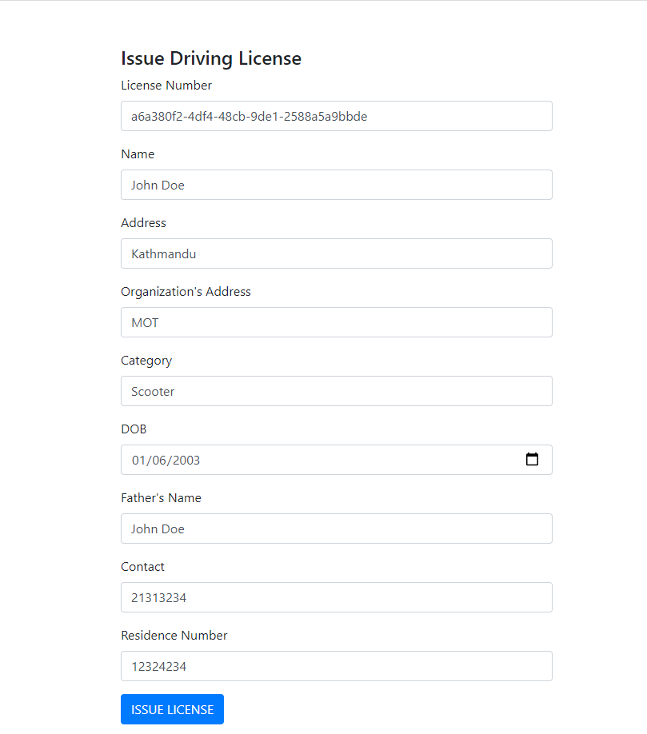
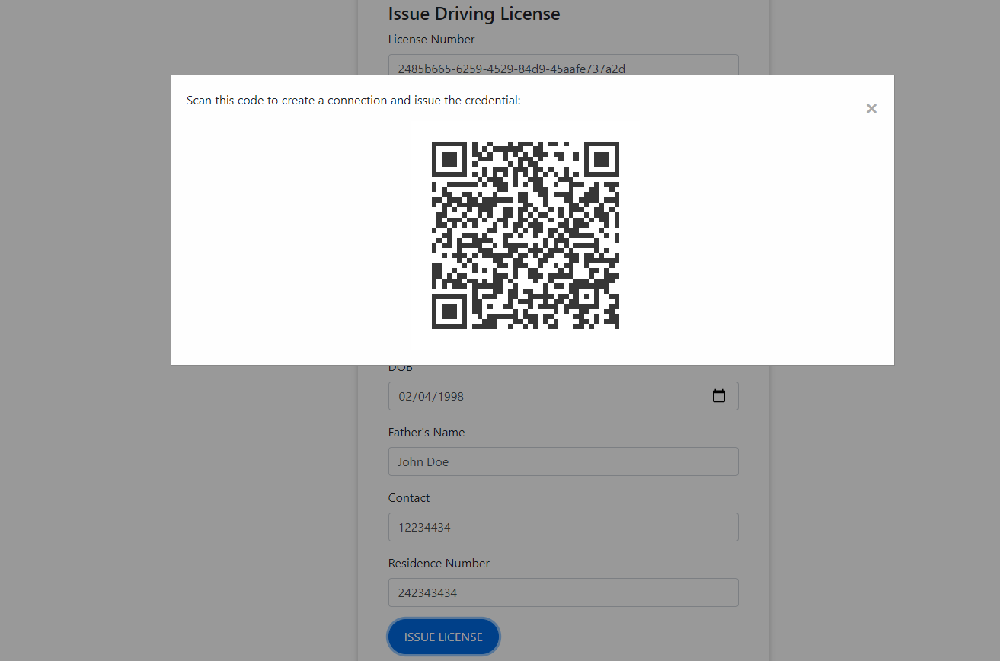

# Driving License Issuance based on Trinsic API(SSI)
This demo shows the use of Trinsic Credentials API calls into a nodejs app with their service client.
It also shows that a webhook implementation can create automated workflows in the app.

## Use Case
In this simple use case, the portal will be used to fill in user data by Driving license Issuing Authority. This would include details that are usually present in a driving license.
Once the driving license is issued, it would be stored in the user's digital wallet which would be Trinsic Wallet app for this project. It can then be used accross any car rentals or verifiers.

The demo of how this can be used can be found in the verification repository ()

## Prerequisites:
- [npm](https://www.npmjs.com/get-npm)

## Install mobile wallet

1. Download the [Android](https://play.google.com/store/apps/details?id=id.streetcred.apps.mobile) or [iOS](https://apps.apple.com/us/app/trinsic-wallet/id1475160728) Trinsic Wallet.

## Steps to issue Driving license credential:

### Prepare issuer portal
1. Clone the repository
`git clone https://github.com/Anushka3174/SSIIssuerApp.git`
3. Install the dependencies
`npm install`
4. Open up the repository in a code editor of your choice

### Running the application

1. Run with npm
`npm start`
2. The web app will run on 'http://localhost:3001/'
2. On the web app, fill in the details and click issue credential.

4. Scan the QR with your mobile wallet.

This is a connection invitation.
Webhooks will automatically issue you a credential once this is scanned and the connection is accepted.

Then, simply accept the credential offer and receive a digital driving license on your wallet!

